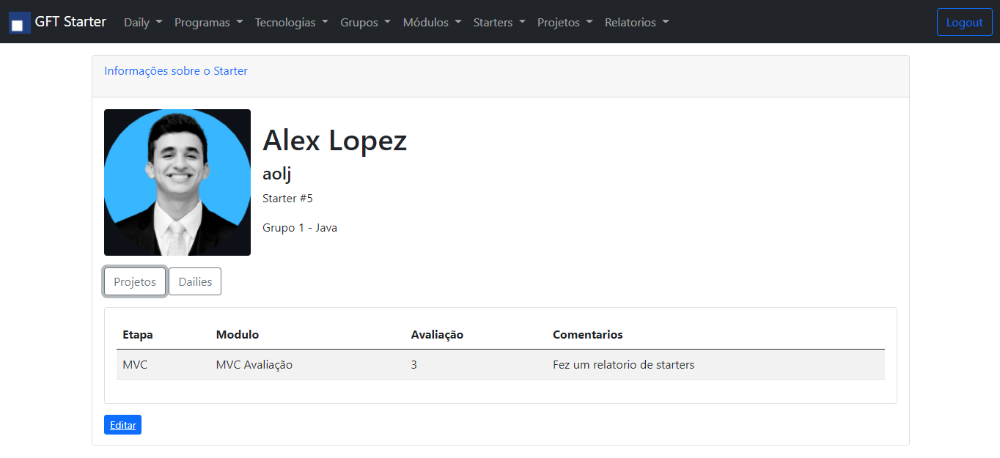

# Controlador de Starters



> API e Frontend de um controlador para gerenciamento dos participantes do programa GFT Starter, seus grupos, tecnologias,
> projetos, dailies e relatórios.

### Funções

O acesso as funcionalidades esta limitado ao nivel de accesso dos usuarios:

- [x] Acesso padrão (limitado) e admistrativo.
- [x] CRUD de todas as entidades.
- [x] Validação dos datos no cliente e servidor.
- [x] Filtro assíncrono de Starters por nome e/ou tecnologia.
- [x] Relatorio Top Starters. Uma lista de todos os starters classificados pelas suas notas nos projetos.
- [x] Upload de foto dos Starters.

Os usuarios com nível de acesso "RESTRICTED" podem apenas acessar ao campo "Daily" onde é possivel
ver e registrar dailies com os starters dos grupos que lhes tem sido designados pelo usuario com nivel
de acesso "FULL".

## 💻 Pré-requisitos

Antes de começar, verifique se você atendeu aos seguintes requisitos:

* Java 11
* SpringBoot 2.5.6

## 🚀 Instação

Basta clonar o projeto

## ☕ Usando o projeto

Na pasta principal rodar o seguinte comando

```
./mvnw spring-boot:run
```

Entre no seu navegador e acesse:
```
http://localhost:8080
```

Faça login como um dos usuarios pre-determiados:

**ADMIN**:
* Email: admin@gft.com
* Senha: password

**Scrum Master**:
* Email: scrumMaster@gft.com
* Senha: password

**Scrum Master 2**:
* Email: scrumMaster2@gft.com
* Senha: password

---
**IMPORTANTE**

É preciso que o projeto rode na porta 8080 do seu computador. Caso contrario, muitas funcionalidades podem se ver afetadas.

---

## 📝 Creditos

Esse projeto foi desenvolvido por [Alex López](https://github.com/lop19029). como parte do programa Starter da  [GFT](https://www.gft.com/br/pt).
